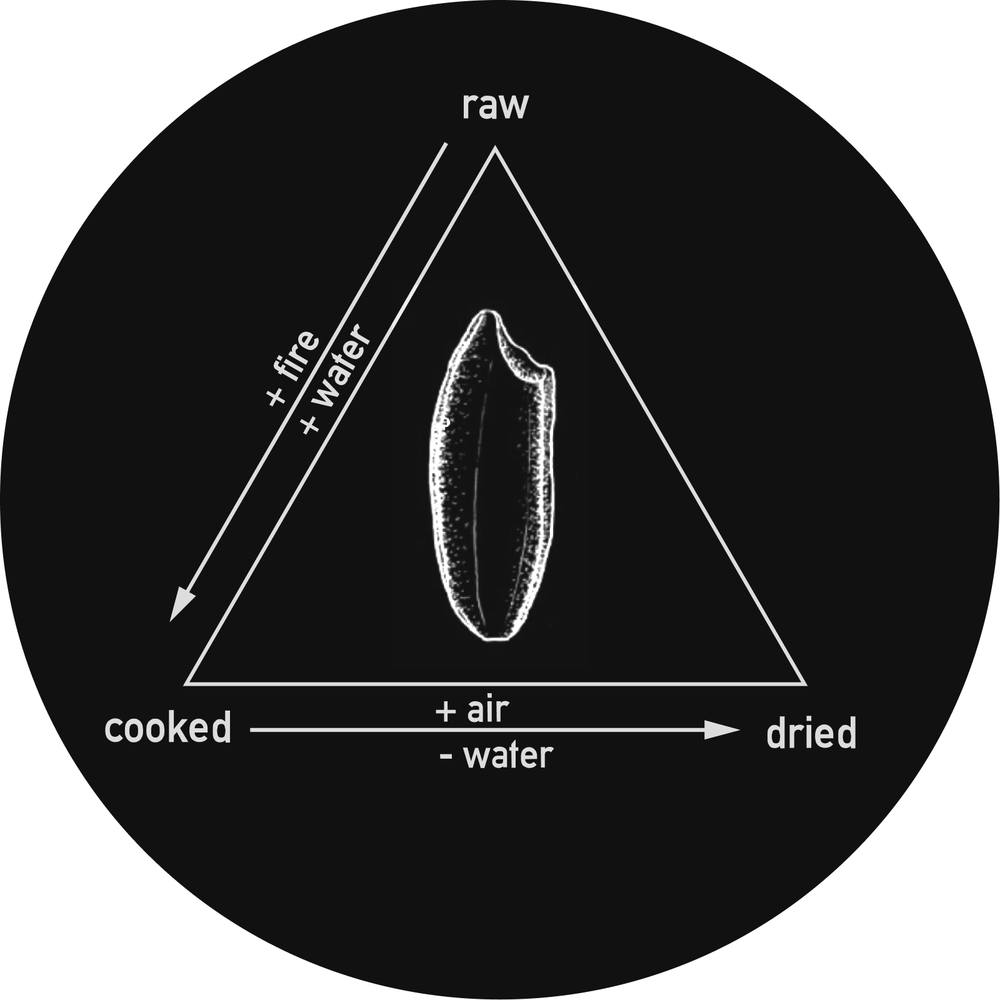
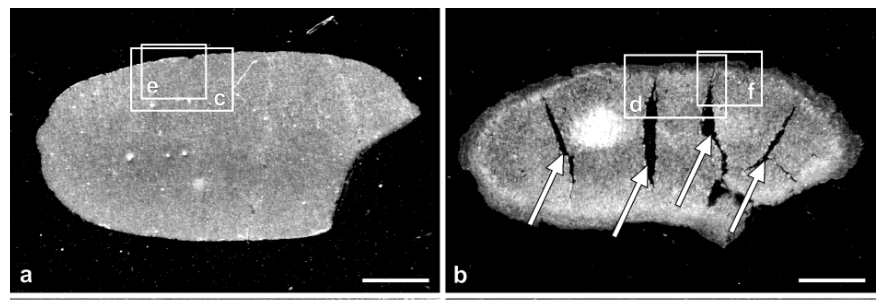
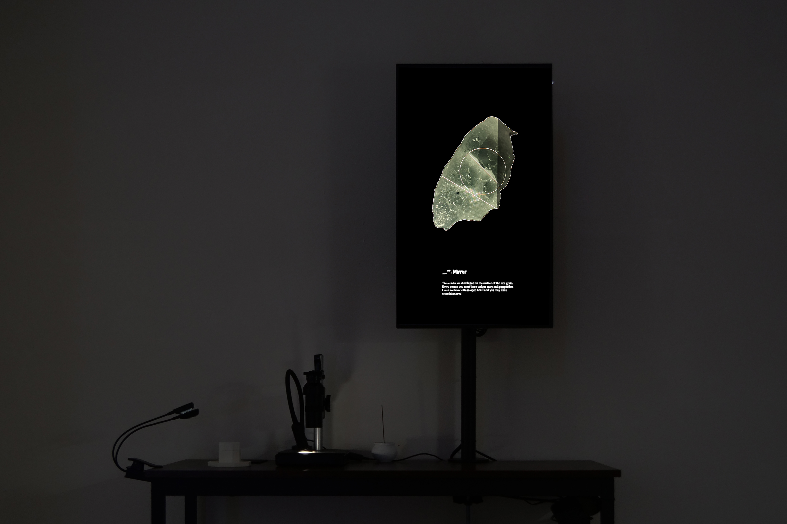

## Information    

- Title: A Message Lies Between the Cracks
- Category: Semesterarbeit
- Students: Qianxun Chen
- Course Title: Master Project 2022-23
- Lecturers: Dr. Petra klusmeyer, Prof. Dr. Andrea Sick, Prof. Dennis P Paul, Prof. Peter von Maydell, Prof. Ralf Baecker
- Year: WS 2022/23

## Keywords
Rice, Divination, Poetics, Installation

---

An imagined divination system based on cracks on cooked rice

Rice, a fundamental sustenance in many cultures, holds deep connections to ceremonies, rituals, and divinations. As automated machines dominate the growing, processing, and cooking of rice, the involvement of digital technology prompts one to wonder about the emergence of new forms of rice divination.

When cooked, the force of heat and water naturally forms cracks on the surface of rice grains. To gain a better understanding of the potential patterns of these cracks, five hundred grains of rice are cooked, dried, and photographed under a digital camera with a microscope lens, creating a comprehensive collection of crack patterns. From this database, a divination system is crafted, relying on the visual analysis of various crack patterns to uncover the secret messages may be held within these cracks.

## Research
#### Cracks on the Rice
The project started with an attempt to find a meeting point between my previous practice in language and the realm of tangible matter. As cooking and food plays an essential role in my life, I decided to work with the fundamental food in my culture: rice. After this decision was made, I went to look for scientific researches on rice. I came across these researches studying the cracks that are formed on rice grains during the cooking process. Having been eating rice for decades, I haven't paid much attention to these tiny cracks. They remind me of the oracle bones in ancient China, where cracks formed on bones after fire are interpreted as divination messages. What if I could invent a divination system based on cracks on rice grains instead?

*Raw(a) and cooked(b) rice grains. From [Histological Structures of Cooked Rice Grain](https://pubs.acs.org/doi/pdf/10.1021/jf034758o), 2003*

*[Changes in histological tissue structure and textural characteristics of rice grain during cooking process](https://www.sciencedirect.com/science/article/pii/S2213329113000063), 2013*

#### Microscope Setup
In order to capture high-quality digital images of cracks on rice grains that can later be processed by algorithms, I decided to employ Raspberry Pi with various lens configurations. After some research on DIY microscopy utilizing Raspberry Pi, I tried two setups: 1) basic raspberry pi camera with macro phone lenses and 2) Arducam camera with adjustable lens. However, the image quality from these two setups were not optimal which lead me to switch to camera/lens options with higher resolutions. The final microscope setup consists of a Raspberry pi HQ camera
 with [Pimoroni microscope lens and accompanying stand](https://shop.pimoroni.com/products/microscope-stand-with-0-12-1-8x-lens?variant=31885089046611).
 To ensure a focused and stable lighting environment, a [magnetic LED work light](https://www.amazon.de/-/en/ENUOTEK-Workshop-Magnetic-Gooseneck-Machines/dp/B07G734Q53) was introduced into the setup. Furthermore, custom-designed top plate and tray were implemented to maintain consistent positioning of the rice grain beneath the lens, affording optimal imaging conditions.

Upon the completion of the physical setup, I proceeded to take photos of 500 grains of rice. This undertaking aimed to provide me with a comprehensive comprehension of the possibilities of fracturing patterns and their corresponding statistical distribution.

*The dataset of 500 grains of cooked rice grains*

#### Software Development for Pattern Recognition
Initially, I was hoping to train an AI model for the task of pattern recognition. But after several attempts employing diverse model architectures, I still couldn't get a model that is good enough to classify the rice grains. It appeared that my dataset is too small for AI approaches and at the same time the cracks are sometimes too subtle for the model to pick them up. Although I ultimately abandoned this approach, the insights garnered during the pre-processing stage of training the model proved helpful and the visual output from them are very interesting. So Later I gave up on the AI approach completely and redirected my efforts toward building a system using Open CV.

To conduct a comprehensive analysis of the visual attributes within a given image input, an assemblage of algorithms was employed, including Otsu thresholding, contour tracing, as well as circles and lines detection. Through the application of these algorithms, the distinctive visual characteristics inherent in the image were extracted. Subsequently, these extracted visual features underwent further processing with predetermined rules tailored to various categories. This process facilitats the assignment of a specific class to each individual rice grain based on visual analysis of the image.

More details of the algorithm can be found in the following github repositories:
- [Backend](https://github.com/cqx931/riceInterface)
- [Frontend](https://github.com/cqx931/rice_interface_web_socket)

#### Divination Systems
The realm of divination encompasses a plethora of diverse methodologies, which can be broadly classified into two principal approaches. The first approach relies upon abstract numbers and randomness, while the second approach draws upon visual imagery and the evocative power of associations. Representations of both approaches can be found in existing rice-based divination systems. In China, rice can be used as one of the methods for divination according to I Ching(米卦). The I Ching hexagrams can be calculated by taking three draws from a bowl of rice that is filled with 1080 grains of rice. In Japan a ritual using divination known as the Kayu Ura(粥占) is performed on January 15th to predict the weather and to foresee the quality of the year’s Rice harvest. The oldest form of this ceremony involves a Shinto priest examining the mould that has formed on a bowl of rice porridge that has been stored in a special box for several days.

For the divination system designed for this project, I tried to draw inspirations from both approaches. In order to establish a cohesive connection between visual cues and textual elements, I assigned evocative metaphorical terms, such as "Mirror," "The Teller," and "The Divider," as names for the various categories encompassing crack patterns. These chosen names serve as a unifying element, bridging the visual representations with the accompanying textual components.

During the divination process, a concise message is generated based on pre-written text tailored to align with the specific category of the observed crack pattern. While multiple variations of text may be generated within the same category, they adhere to a shared theme or direction.

Although the original design encompassed a total of 24 categories, the divination system employed for the master project exhibition was limited to 12 categories due to the constraints of the pattern recognition algorithm.

## Master Project Exhibition
The installation consists of

- Rice samples of raw, freshly cooked and dried rice grains.
- A divination station where the audience can have their own piece of rice being read from
- A rice archive consists of 500 grains of cooked, dried rice
- Film prints of sample rice patterns

---

## References
#### Artistic References
- Jen Bervin: [Silk Poems](https://www.jenbervin.com/projects/silk-poems)
- Agnes Meyer-Brandis: [Microfluid Oracle Chip & Autopoesis Answering Machine (2018-ongoing)](http://blubblubb.net/oracle/index.html)
- Thiago Hersan: [Algotypes(tarot) (2021)](https://thiagohersan.com/algotypes-tarot/)

#### Theoretical References
- [Tedlock, Barbara. “Divination as a Way of Knowing: Embodiment, Visualisation, Narrative, and Interpretation.” Folklore, vol. 112, no. 2, 2001, pp. 189–97. JSTOR](http://www.jstor.org/stable/1260832)
- O’Sullivan, S. (2016) ‘On the Diagram (and a Practice of Diagrammatics)’, in K. Schneider, B. Yasar, and Dominique Lévy (eds) Situational diagram. New York: Dominique Lévy.
- [Mysticism and Language, Lawrence J. Hatab, 1982](https://philarchive.org/archive/HATMAL)
- [Technoshamanism: Hmkv ausstellungsmagazin 2021/3. DRUCKVERLAG KETTLER.2022](https://www.hmkv.de/files/hmkv/ausstellungen/2021/Technoschamanismus/05_Publikation/2110_Technoschamanismus_Magazin_Web.pdf)
- [Concept Text from the exhibition Magical Hackerism or the Elasticity of Resilience at Savvy Contemporary, 2022](https://savvy-contemporary.com/site/assets/files/8781/magicalhackerism_concept.pdf)

---

#### Special Thanks
- Assistance in Software Development by [Alberto Harres](https://github.com/mneunomne)
- Text contribution by Mariana Roa Oliva
- Documentation Photos by Hsun-Hsiang Hsu and Yimei Zhang
