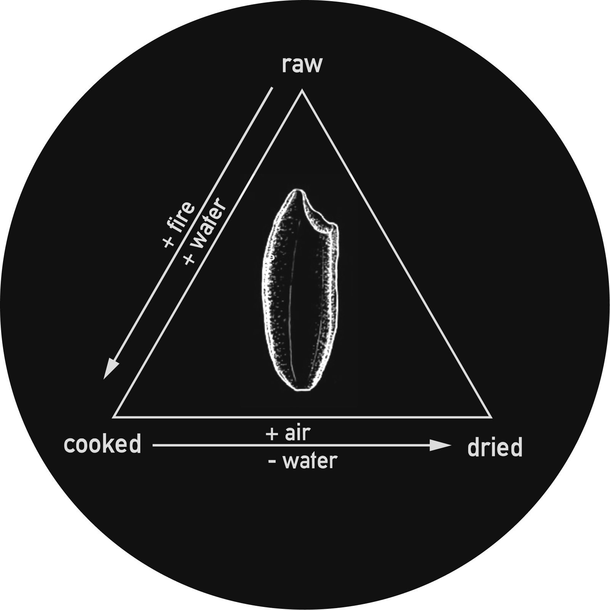
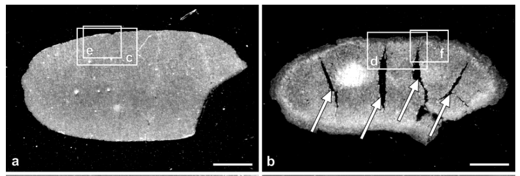
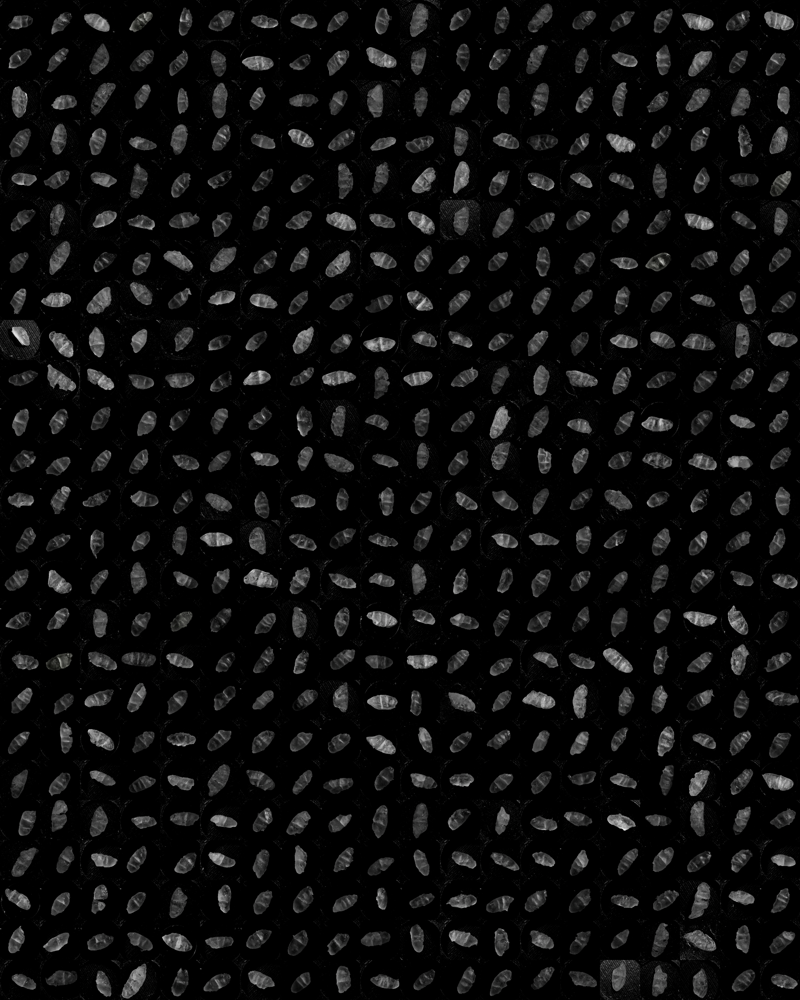
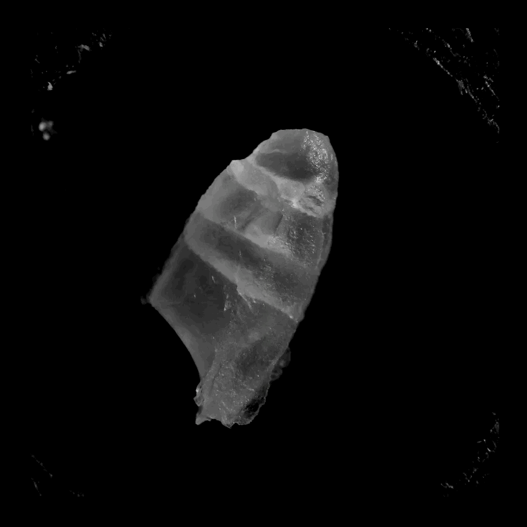
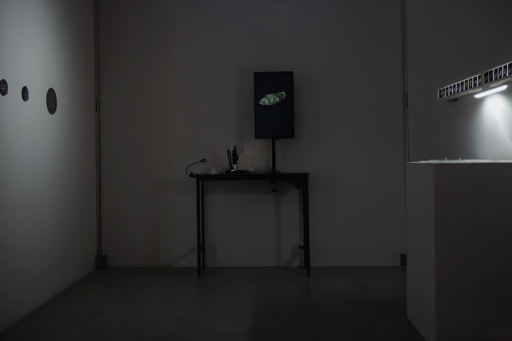
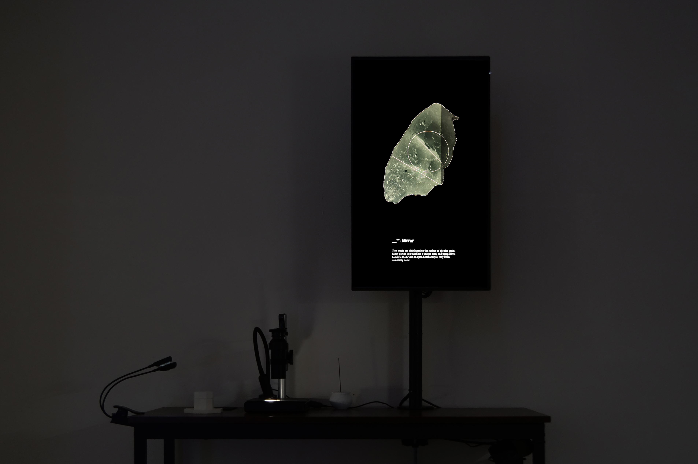

## Information    

- Title: A Message Lies Between the Cracks
- Category: Semesterarbeit
- Students: Qianxun Chen
- Course Title: Master Project 2022-23
- Lecturers: Dr. Petra klusmeyer, Prof. Dr. Andrea Sick, Prof. Dennis P Paul, Prof. Peter von Maydell, Prof. Ralf Baecker
- Year: WS 2022/23

---

An imagined divination system based on cracks on cooked rice

Rice, a fundamental sustenance in many cultures, holds deep connections to ceremonies, rituals, and divinations. As automated machines dominate the growing, processing, and cooking of rice, the involvement of digital technology prompts one to wonder about the emergence of new forms of rice divination.

*Raw(a) and cooked(b) rice grains. From [Histological Structures of Cooked Rice Grain](https://pubs.acs.org/doi/pdf/10.1021/jf034758o), 2003*

When cooked, the force of heat and water naturally forms cracks on the surface of rice grains. To gain a better understanding of the potential patterns of these cracks, five hundred grains of rice are cooked, dried, and photographed under a digital camera with a microscope lens, creating a comprehensive collection of crack patterns.

*The dataset of 500 grains of cooked rice grains*

 From this dataset, a divination system is crafted, based on visual analysis of various crack patterns using computer vision techniques. Similar patterns can be identified by the algorithm and mapped to a pre-defined category. Every category has a metaphorical name as a binding point between the visuals and the text. During each divination, a short message based on pre-written text is generated according to the category of the crack pattern.

---

#### Theoretical References
- [Tedlock, Barbara. “Divination as a Way of Knowing: Embodiment, Visualisation, Narrative, and Interpretation.” Folklore, vol. 112, no. 2, 2001, pp. 189–97. JSTOR](http://www.jstor.org/stable/1260832)
- O’Sullivan, S. (2016) ‘On the Diagram (and a Practice of Diagrammatics)’, in K. Schneider, B. Yasar, and Dominique Lévy (eds) Situational diagram. New York: Dominique Lévy.
- [Mysticism and Language, Lawrence J. Hatab, 1982](https://philarchive.org/archive/HATMAL)
- [Technoshamanism: Hmkv ausstellungsmagazin 2021/3. DRUCKVERLAG KETTLER.2022](https://www.hmkv.de/files/hmkv/ausstellungen/2021/Technoschamanismus/05_Publikation/2110_Technoschamanismus_Magazin_Web.pdf)

#### Open Source Code
- [Backend](https://github.com/cqx931/riceInterface)
- [Frontend](https://github.com/cqx931/rice_interface_web_socket)
---

#### Special Thanks
- Assistance in software development: [Alberto Harres](https://github.com/mneunomne)
- Text contribution: Mariana Roa Oliva
- Documentation Photos: Hsun-Hsiang Hsu and Yimei Zhang
